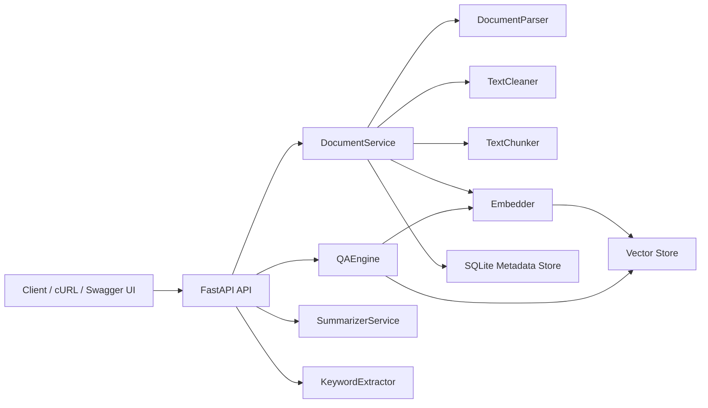

# DocuMind

DocuMind is a backend-focused Python project for intelligent document analysis and grounded question-answering. Users can upload PDF, TXT, and CSV documents, extract and clean text, chunk and index content, and ask natural-language questions that return grounded answers with source citations. The project is designed to feel portfolio-ready rather than toy-like: clean architecture, FastAPI endpoints, SQLite metadata tracking, persistent retrieval, tests, Docker support, and GitHub Codespaces compatibility.

## Why This Project Stands Out

- Demonstrates end-to-end backend engineering, not just prompt wiring.
- Shows practical RAG patterns: parsing, cleaning, chunking, embedding, retrieval, and grounded answer synthesis.
- Includes production-minded concerns like environment-based config, structured logging, persistence, tests, and container/devcontainer support.
- Runs locally with a lightweight default stack and upgrades cleanly to `sentence-transformers + ChromaDB`.

## Core Features

- Upload PDF, TXT, and CSV documents through a FastAPI API.
- Parse and normalize extracted content with file-type-aware processing.
- Chunk long documents into overlapping windows for retrieval.
- Generate embeddings with a lightweight default backend and optional `sentence-transformers` support.
- Persist document metadata in SQLite.
- Persist vectors in a simple JSON-backed store by default, with optional ChromaDB support.
- Answer natural-language questions using retrieved chunks and return citation snippets.
- Summarize documents and extract keywords.
- Provide offline-friendly fallbacks:
  - hash-based embeddings for tests or constrained environments
  - extractive summarization / QA when an external LLM is not configured
- Optionally use the OpenAI API for richer summary and answer generation.

## Architecture



## Project Structure

```text
DocuMind/
|-- .devcontainer/
|   `-- devcontainer.json
|-- app/
|   |-- api/
|   |   |-- deps.py
|   |   |-- router.py
|   |   `-- routes/
|   |       |-- documents.py
|   |       |-- health.py
|   |       |-- query.py
|   |       `-- upload.py
|   |-- core/
|   |   |-- config.py
|   |   |-- container.py
|   |   `-- logging_config.py
|   |-- db/
|   |   |-- database.py
|   |   `-- models.py
|   |-- schemas/
|   |   |-- common.py
|   |   |-- document.py
|   |   `-- query.py
|   |-- services/
|   |   |-- chunker.py
|   |   |-- document_parser.py
|   |   |-- document_service.py
|   |   |-- embedder.py
|   |   |-- keyword_extractor.py
|   |   |-- llm_provider.py
|   |   |-- qa_engine.py
|   |   |-- summarizer.py
|   |   |-- text_cleaner.py
|   |   `-- vector_store.py
|   `-- main.py
|-- data/
|   |-- chroma/
|   `-- uploads/
|-- tests/
|   |-- conftest.py
|   |-- test_api.py
|   |-- test_chunker.py
|   |-- test_document_parser.py
|   |-- test_qa_engine.py
|   `-- test_text_cleaner.py
|-- .env.example
|-- .gitignore
|-- .pre-commit-config.yaml
|-- Dockerfile
|-- Makefile
|-- pyproject.toml
|-- requirements-ai.txt
|-- requirements-dev.txt
|-- requirements.txt
`-- README.md
```

## Tech Stack

- Python 3.11+ in Codespaces, compatible with Python 3.10+ locally
- FastAPI
- Pydantic / pydantic-settings
- Uvicorn
- PyMuPDF
- pandas
- SQLite + SQLAlchemy
- pytest
- Ruff
- mypy
- python-dotenv
- Optional AI extras:
  - sentence-transformers
  - ChromaDB
  - OpenAI API

## Processing Pipeline

1. File upload hits `POST /api/v1/documents/upload`.
2. The upload is validated and persisted under `data/uploads/`.
3. The parser extracts raw text and file-specific metadata.
4. The cleaner normalizes whitespace and removes obvious extraction noise.
5. The chunker splits content into overlapping word windows.
6. Chunk records and document metadata are written to SQLite.
7. Embeddings are generated and written to the configured vector backend.
8. Queries embed the question, retrieve top chunks, and synthesize a grounded answer with citations.

## Local Setup

### 1. Create a virtual environment

```bash
python -m venv .venv
```

Activate it:

- Windows PowerShell:

```powershell
.venv\Scripts\Activate.ps1
```

- macOS / Linux:

```bash
source .venv/bin/activate
```

### 2. Install dependencies

Base app + tests:

```bash
pip install --upgrade pip
pip install -r requirements-dev.txt
```

Optional AI extras for stronger semantic retrieval:

```bash
pip install -r requirements-ai.txt
```

### 3. Configure environment variables

```bash
cp .env.example .env
```

Key options:

- `DOCUMIND_EMBEDDING_BACKEND=hash`
  - Default. Good for offline development and tests.
- `DOCUMIND_VECTOR_BACKEND=simple`
  - Default. Uses a local JSON-backed vector index.
- `DOCUMIND_EMBEDDING_BACKEND=sentence-transformer`
- `DOCUMIND_VECTOR_BACKEND=chroma`
  - Recommended upgrade path after installing `requirements-ai.txt`.
- `DOCUMIND_OPENAI_API_KEY`
  - Optional. Enables richer summary and answer generation while keeping retrieval grounded in local documents.

### 4. Run the API

```bash
uvicorn app.main:app --reload
```

Open:

- Swagger UI: [http://localhost:8000/docs](http://localhost:8000/docs)
- ReDoc: [http://localhost:8000/redoc](http://localhost:8000/redoc)

## Running in GitHub Codespaces

This repo includes a `.devcontainer/devcontainer.json` file, so Codespaces can provision a Python 3.11 environment automatically.

Steps:

1. Open the repository in GitHub Codespaces.
2. Wait for the post-create dependency installation to finish.
3. Copy `.env.example` to `.env` if you want to customize settings.
4. Optionally install the AI extras:

```bash
pip install -r requirements-ai.txt
```

5. Run:

```bash
uvicorn app.main:app --host 0.0.0.0 --port 8000 --reload
```

6. Forward port `8000` and open the API docs.

## Docker

Build:

```bash
docker build -t documind .
```

Run:

```bash
docker run -p 8000:8000 documind
```

## API Endpoints

| Method | Endpoint | Purpose |
|---|---|---|
| `GET` | `/` | Basic service info |
| `GET` | `/api/v1/health` | Health check |
| `POST` | `/api/v1/documents/upload` | Upload and ingest a document |
| `GET` | `/api/v1/documents` | List uploaded documents |
| `GET` | `/api/v1/documents/{document_id}` | Get document metadata |
| `POST` | `/api/v1/documents/{document_id}/summarize` | Generate or refresh a summary |
| `GET` | `/api/v1/documents/{document_id}/keywords` | Extract keywords |
| `GET` | `/api/v1/documents/{document_id}/stats` | View document statistics |
| `POST` | `/api/v1/query` | Ask grounded questions across indexed documents |

## Example Usage

### Upload a document

```bash
curl -X POST "http://localhost:8000/api/v1/documents/upload" \
  -H "accept: application/json" \
  -H "Content-Type: multipart/form-data" \
  -F "file=@sample.txt"
```

Example response:

```json
{
  "document": {
    "id": "2e167d2e-5d10-4d15-94b9-2dc6af6e35d4",
    "filename": "sample.txt",
    "file_type": "txt",
    "upload_timestamp": "2026-03-30T22:05:12.118174+00:00",
    "chunk_count": 2,
    "word_count": 148,
    "page_count": null,
    "estimated_reading_minutes": 1,
    "summary_status": "pending"
  },
  "metadata": {}
}
```

### Ask a question

```bash
curl -X POST "http://localhost:8000/api/v1/query" \
  -H "Content-Type: application/json" \
  -d '{
    "question": "What file types does the system support?",
    "top_k": 3
  }'
```

Example response:

```json
{
  "question": "What file types does the system support?",
  "answer": "DocuMind supports PDF, TXT, and CSV uploads for downstream retrieval and question answering.",
  "citations": [
    {
      "document_id": "2e167d2e-5d10-4d15-94b9-2dc6af6e35d4",
      "filename": "sample.txt",
      "chunk_id": "2e167d2e-5d10-4d15-94b9-2dc6af6e35d4-chunk-0",
      "chunk_index": 0,
      "snippet": "DocuMind supports PDF, TXT, and CSV uploads for downstream retrieval and question answering.",
      "score": 0.81,
      "page_number": null
    }
  ],
  "confidence_note": "High confidence: multiple closely matched chunks support this answer.",
  "retrieval_count": 1
}
```

### Summarize a document

```bash
curl -X POST "http://localhost:8000/api/v1/documents/{document_id}/summarize"
```

### Get keywords

```bash
curl "http://localhost:8000/api/v1/documents/{document_id}/keywords?top_n=10"
```

### Get document stats

```bash
curl "http://localhost:8000/api/v1/documents/{document_id}/stats"
```

## Testing

Run all tests:

```bash
pytest
```

The tests cover:

- text normalization
- chunk overlap behavior
- document parsing for TXT and CSV
- QA engine answer/citation behavior
- API upload, summary, stats, and query flow

## Design Notes

- The base install defaults to a hash embedder plus a simple JSON vector store so the project runs reliably on ordinary local machines and in constrained environments.
- Installing `requirements-ai.txt` upgrades the project to `sentence-transformers/all-MiniLM-L6-v2` plus ChromaDB for stronger semantic retrieval.
- The fallback path keeps tests and offline development simple without breaking the architecture.
- Summary and answer generation stay grounded in retrieved or document-local context, even when OpenAI is configured.

## Potential Future Improvements

- Add async background processing with Celery or Dramatiq for larger document ingestion workloads.
- Introduce OCR for scanned PDFs and image-heavy documents.
- Add per-user auth, multi-tenant document collections, and document deletion workflows.
- Swap the extractive fallback answerer for a stronger open-source local model pipeline.
- Add evaluation metrics for retrieval quality and answer faithfulness.

## Resume Bullet Suggestions

- Built a FastAPI-based document intelligence platform that ingests PDF, TXT, and CSV files, extracts and normalizes content, and powers grounded question-answering with source citations using a retrieval-augmented architecture.
- Designed a modular NLP pipeline with embedders, persistent vector search, SQLite metadata tracking, and structured logging, enabling semantic retrieval, summarization, keyword extraction, and document analytics.
- Productionized the project with automated tests, Docker support, environment-based configuration, Codespaces compatibility, and developer tooling including Ruff, mypy, and pre-commit.

## Interview Talking Points

1. Why the project uses a layered service architecture instead of putting parsing and retrieval logic directly in route handlers.
2. How chunk size and overlap affect retrieval quality, latency, and citation usefulness.
3. Why the vector store is abstracted and how the system can run in both lightweight local mode and AI-enhanced mode.
4. How the system stays grounded by generating answers only from retrieved chunks and returning explicit snippets.
5. What design choices were made to keep the project runnable both locally and in Codespaces, even without external API access.

## Future Enhancements for a Stronger Portfolio

1. Add document-level evaluation dashboards that compare retrieval hit quality, answer confidence, and chunk relevance over benchmark queries.
2. Support OCR and layout-aware parsing for scanned PDFs, invoices, and contracts.
3. Add authentication, multi-user workspaces, and background job queues to evolve the project from a portfolio app into a more production-like platform.
